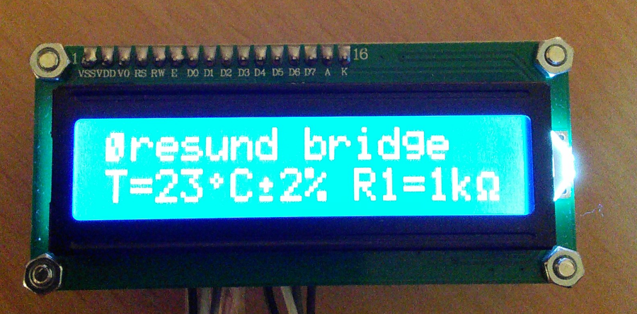

This example shows how to easily reuse existing public domain 5x8 pixel
characater bitmaps from the [u8g2](https://github.com/olikraus/u8g2/) project.


```C++
  SmartLCD.CurPos(0, 0);            //Set the cursor to row 0 column 0

  // "Øresund bridge"
  SmartLCD.PrintCustChar(CUST_CHAR_Oslash);
  SmartLCD.Print("resund bridge");

  SmartLCD.CurPos(1, 0);            //Set the cursor to row 1 column 0

  // "T=23°C±2% R1=1kΩ"
  SmartLCD.Print("T=23");
  SmartLCD.PrintCustChar(CUST_CHAR_degree);
  SmartLCD.Print("C");
  SmartLCD.PrintCustChar(CUST_CHAR_plusminus);
  SmartLCD.Print("2% R1=1k");
  SmartLCD.PrintCustChar(CUST_CHAR_Omega);
```


